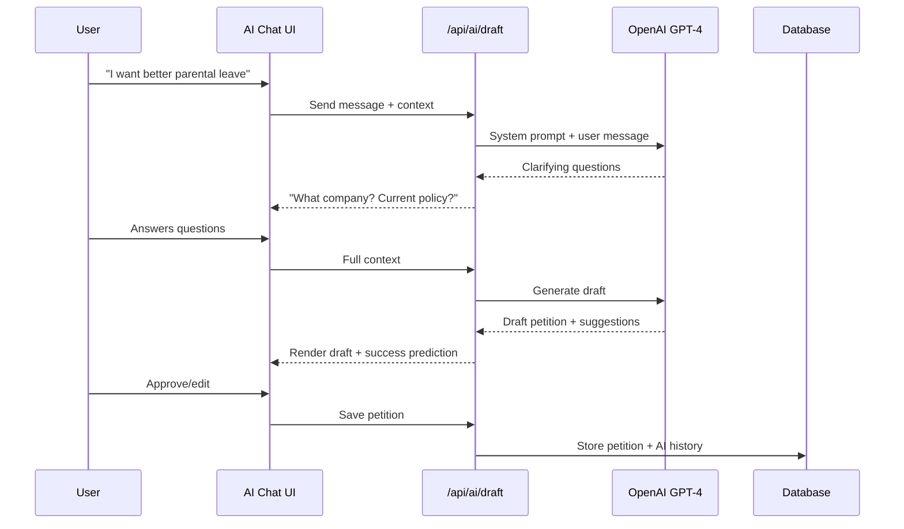

# Workplace Petition Platform

## Why This Niche Works

Workplace petitions have unique needs that current platforms ignore:

- **Privacy anxiety** - Employees fear retaliation; need anonymous-but-verified options
- **Specific targets** - HR, executives, boards have different pressure points
- **Legal complexity** - Labor law varies; AI can help navigate
- **Collective action** - Thresholds matter (30% for union votes, etc.)

---

## Recommended Tech Stack

**Next.js 14 + React** - Best choice because:

- SEO critical for petition discovery (SSR/SSG)
- Modern UI for AI chat interface
- API routes built-in for AI integration
- NextAuth.js for tiered authentication
- You have Next.js experience ([ProjManager/](ProjManager/))

**Database:** PostgreSQL with Prisma ORM (you already use this in ProjManager)

**AI:** OpenAI API (GPT-4) for drafting/coaching

**Auth:** NextAuth.js with email + social + identity verification tier

**Hosting:** Vercel (optimal for Next.js)

---

## Architecture

```mermaid
flowchart TB
    subgraph frontend [Frontend - Next.js]
        Pages[Pages/Routes]
        AIChat[AI Assistant UI]
        Dashboard[Creator Dashboard]
        SignPage[Petition Sign Page]
    end

    subgraph api [API Routes]
        PetitionAPI[/api/petitions]
        SignatureAPI[/api/signatures]
        AIAPI[/api/ai/draft]
        AuthAPI[NextAuth]
    end

    subgraph services [External Services]
        OpenAI[OpenAI GPT-4]
        EmailService[Email - Resend]
        VerifyService[Identity Verification]
    end

    subgraph db [Database]
        PostgreSQL[(PostgreSQL)]
    end

    Pages --> api
    AIChat --> AIAPI
    AIAPI --> OpenAI
    api --> PostgreSQL
    AuthAPI --> VerifyService
    PetitionAPI --> EmailService
```

---

## Core Features

### Phase 1: Foundation

1. **Petition CRUD** - Create, edit, publish, close petitions
2. **Signature collection** - With email verification
3. **Progress tracking** - Visual goal meter, milestone notifications
4. **Basic sharing** - Social links, embed widget
5. **User accounts** - NextAuth with Google/email

### Phase 2: AI Assistant (Primary Differentiator)

1. **AI Drafting Chat** - Conversational petition builder

   - "I want to petition for better parental leave at my company"
   - AI asks clarifying questions, drafts title/description
   - Suggests effective targets (CEO vs HR vs Board)

2. **Success Prediction Engine**

   - Analyzes petition against historical patterns
   - "Petitions like this succeed 34% of the time"
   - Suggests improvements to increase odds

3. **Strategy Coaching**

   - Timing advice ("Launch Monday morning for peak visibility")
   - Threshold alerts ("You need 30% of employees for legal weight")
   - Escalation suggestions ("Consider adding media contacts")

4. **Template Library**

   - Pre-built templates for common workplace issues:
     - Pay equity, benefits, safety, remote work, layoffs, etc.

### Phase 3: Tiered Verification

1. **Basic** - Email verification only
2. **Verified Employee** - Company email domain + LinkedIn
3. **Anonymized Verified** - Third-party confirms employment without revealing identity

   - "Verified employee of [Company]" without exposing name

### Phase 4: Workplace-Specific Features

1. **Retaliation protection resources** - Legal info, labor board contacts
2. **Company response tracking** - Did management respond?
3. **Internal vs external petitions** - Private (company-only) vs public
4. **Union/organizing mode** - Special features for collective bargaining

---

## Database Schema (Key Models)

```prisma
model User {
  id            String    @id @default(cuid())
  email         String    @unique
  name          String?
  verificationTier  VerificationTier @default(BASIC)
  petitionsCreated  Petition[]
  signatures        Signature[]
}

model Petition {
  id          String   @id @default(cuid())
  title       String
  description String   @db.Text
  target      String   // Who is being petitioned
  company     String?  // Optional: specific company
  goal        Int      // Signature goal
  status      PetitionStatus @default(ACTIVE)
  visibility  Visibility @default(PUBLIC)
  createdAt   DateTime @default(now())
  creator     User     @relation(fields: [creatorId])
  signatures  Signature[]
  updates     PetitionUpdate[]
  aiDraftHistory  Json?  // Store AI conversation
}

model Signature {
  id          String   @id @default(cuid())
  petition    Petition @relation(fields: [petitionId])
  user        User     @relation(fields: [userId])
  comment     String?
  isAnonymous Boolean  @default(false)
  verifiedEmployee Boolean @default(false)
  createdAt   DateTime @default(now())
}

enum VerificationTier {
  BASIC
  VERIFIED_EMAIL
  VERIFIED_EMPLOYEE
  ANONYMIZED_VERIFIED
}
```

---

## AI Drafting Flow



---

## UI Design Direction

Given the workplace/advocacy focus:

- **Professional but accessible** - Not corporate sterile, not activist aggressive
- **Trust-building elements** - Privacy badges, verification indicators, legal resource links
- **Clean typography** - Readable petition text is critical
- **Subdued palette** - Blues/greens convey trust; avoid red (alarm) except for CTAs
- **Progress-focused** - Prominent signature meters, milestone celebrations

---

## Project Structure

```
PetitionHub/
├── app/
│   ├── (auth)/
│   │   ├── login/page.tsx
│   │   └── register/page.tsx
│   ├── (main)/
│   │   ├── page.tsx              # Homepage
│   │   ├── create/page.tsx       # AI-assisted creation
│   │   ├── p/[slug]/page.tsx     # Petition view/sign
│   │   └── dashboard/page.tsx    # Creator dashboard
│   ├── api/
│   │   ├── petitions/route.ts
│   │   ├── signatures/route.ts
│   │   └── ai/
│   │       └── draft/route.ts
│   └── layout.tsx
├── components/
│   ├── ai/
│   │   ├── DraftChat.tsx
│   │   └── SuccessPredictor.tsx
│   ├── petition/
│   │   ├── PetitionCard.tsx
│   │   ├── SignatureForm.tsx
│   │   └── ProgressMeter.tsx
│   └── ui/
├── lib/
│   ├── ai.ts                     # OpenAI integration
│   ├── db.ts                     # Prisma client
│   └── verification.ts           # Identity verification
├── prisma/
│   └── schema.prisma
└── types/
    └── index.ts
```

---

## Key Differentiators Summary

| Feature | Change.org | Your Platform |

|---------|------------|---------------|

| AI drafting | None | Full conversational assistant |

| Success prediction | None | ML-based likelihood scoring |

| Strategy coaching | None | Timing, targeting, escalation advice |

| Anonymous-but-verified | None | Third-party employee verification |

| Workplace focus | Generic | Templates, legal resources, retaliation info |

| Company response tracking | None | Public accountability dashboard |

---

## Implementation Phases

**Phase 1 (MVP - 2-3 weeks):**

Core petition CRUD, signing, basic auth, simple UI

**Phase 2 (AI - 1-2 weeks):**

AI drafting chat, success prediction, strategy tips

**Phase 3 (Verification - 1 week):**

Tiered verification, anonymous-verified mode

**Phase 4 (Polish - 1 week):**

Templates, company response tracking, mobile optimization